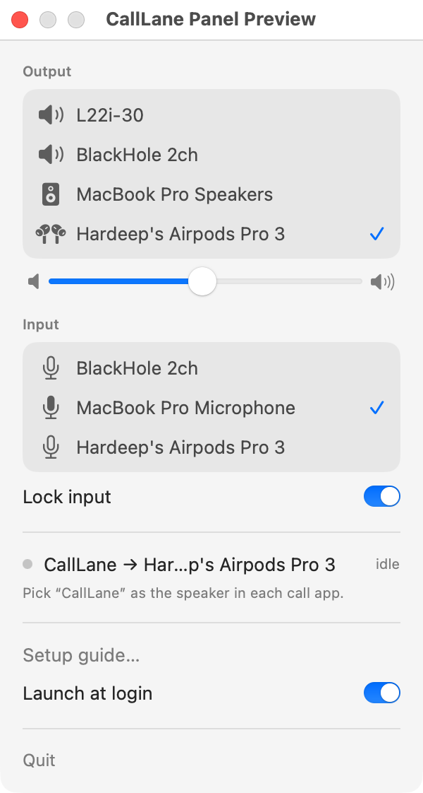

# CallLane

Keep your music loud while you are on a call. macOS lowers every other sound by about
20 dB when a call app runs, and there is no setting to stop it. CallLane gives call
apps their own output device, `Calls`, that wraps your real headphones. macOS ducks only
the audio on the call app's device, so your media stays at full volume.

CallLane also pins your input to the mic you choose, so AirPods stay in the
high-quality listening profile instead of the headset profile.

No drivers. No kernel extensions. No permission prompts.

<picture>
  <source media="(prefers-color-scheme: dark)" srcset="docs/panel-dark.png">
  
</picture>

## Install

```sh
brew trust --tap rav4nn/tap
brew install --cask --no-quarantine rav4nn/tap/calllane
```

`brew trust` is needed on Homebrew 6, which loads third-party casks only from
taps you trust. `--no-quarantine` is needed because CallLane is signed ad-hoc, not with an Apple
Developer ID. Without it, macOS shows "cannot verify" and you must allow it under
System Settings → Privacy & Security.

Or build from source with the Xcode Command Line Tools: `git clone`, then `make run`.

## Use

1. Launch CallLane. A phone icon appears in the menu bar. It creates the `Calls` device.
2. In each call app, pick `Calls` as the speaker. Once per app. The setup guide in the
   menu lists the exact path for FaceTime, Zoom, Meet, Slack, Teams, Discord, WhatsApp.
3. Keep your headphones as the system output. Keep the microphone on your Mac's
   built-in mic or a USB mic, and turn on Lock input.

The phone icon fills while a call app uses `Calls`.

## How it works

`Calls` is a public CoreAudio aggregate device with one sub-device: your current
default output. CallLane rewrites the sub-device whenever your output changes, so
`Calls` always plays through the headphones you are on. Call apps remember `Calls` by
its fixed UID across those changes.

## Limits

- Apple does not document that ducking stops at the aggregate boundary. A macOS update
  could change this.
- Volume keys do nothing while `Calls` is the system output. CallLane reverts that
  selection and tells you.
- Safari has no per-site speaker picker, so calls in Safari cannot use `Calls`.
- Spatial Audio and head tracking may not apply to the call on `Calls`.
- Tested on macOS 26 with AirPods Pro 3. Runs on macOS 14 and later.

## Uninstall

Menu → "Remove Calls device and quit", then `brew uninstall --cask calllane`.
If you skip the first step, remove the `Calls` device in Audio MIDI Setup.

## License

MIT.
